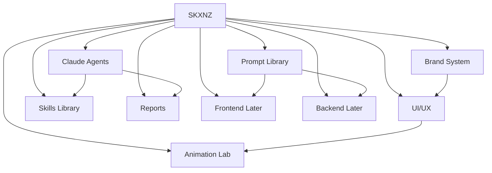

# MASTER MAP

Text map of the whole SKXNZ command system.

## Structure
- **SKXNZ** → root brand + product ([[BRAND_MEMORY]], [[PRODUCT_MEMORY]])
  - **Brand System** → [[BRAND_MEMORY]] · [[BRAND_COLORS]] · [[REFERENCE_BOARD]] · [[SKXNZ_BRAND_GUARDIAN]]
  - **UI/UX** → [[UI_UX_MEMORY]] · [[DESIGN_RULEBOOK]] · [[TYPOGRAPHY_RULES]] · [[COMPONENT_RULES]] · [[SKXNZ_UI_UX_LUXURY_DIRECTOR]]
  - **Animation Lab** → [[ANIMATION_MASTER_PLAN]] · [[MOTION_DO_NOT_DO]] · [[SKXNZ_ANIMATION_DIRECTOR]]
  - **Claude Agents** → [[AGENT_OPERATING_SYSTEM]] · [[AGENT_TASK_BOARD]] · [[AGENT_SAFETY_RULES]]
  - **Skills Library** → [[SKILL_INDEX]]
  - **Reports** → [[DAILY_REPORT_TEMPLATE]] · [[SKXNZ_OBSIDIAN_REPORTER]]
  - **Prompt Library** → [[CLAUDE_MASTER_PROMPTS]] · [[CODEX_MASTER_PROMPTS]] · [[SKXNZ_PROMPT_ENGINEER]]
  - **Frontend (later)** → [[FRONTEND_PROMPTS]] · [[SKXNZ_FRONTEND_AUDITOR]]
  - **Backend (later)** → [[TECH_MEMORY]] · [[BACKEND_PROMPTS]] · [[SKXNZ_BACKEND_AUDITOR]]

## Mermaid graph

Related: [[MASTER_INDEX]] · [[GRAPH_RULES]] · [[TAG_SYSTEM]]
